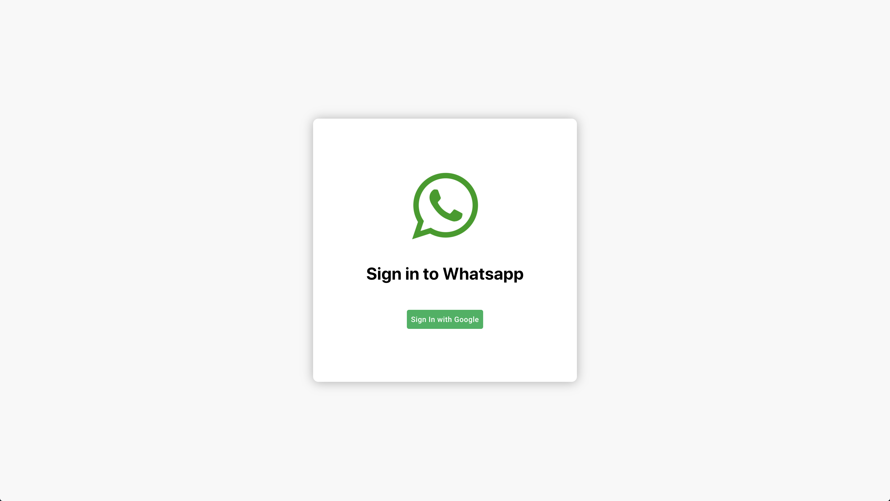

## Whatsapp [WebApp Side-Project]

The Challenge: Can I deliver a product entirely developed by myself?

Frontend: Develop a chat app with reusable components only with SASS-Styled Components skills. State management relies on Redux/Redux Toolkit/Redux Thunk middleware.

Backend: Firebase was the must-go resource as Database & authentication & hosting services.

Every conversation in the app details the technologies used on this project.

### Techonologies used in this project:

- React
- Redux
- Redux Toolkit
- Redux Thunk
- Redux DevTools
- SASS
- Material UI
- Styled Components
- Firebase (realtime database, authentication & hosting)

App online and working here:

<link>https://leo-chat-app-67abd.web.app/</link>

Thanks for visiting!
### Andres Nieves
